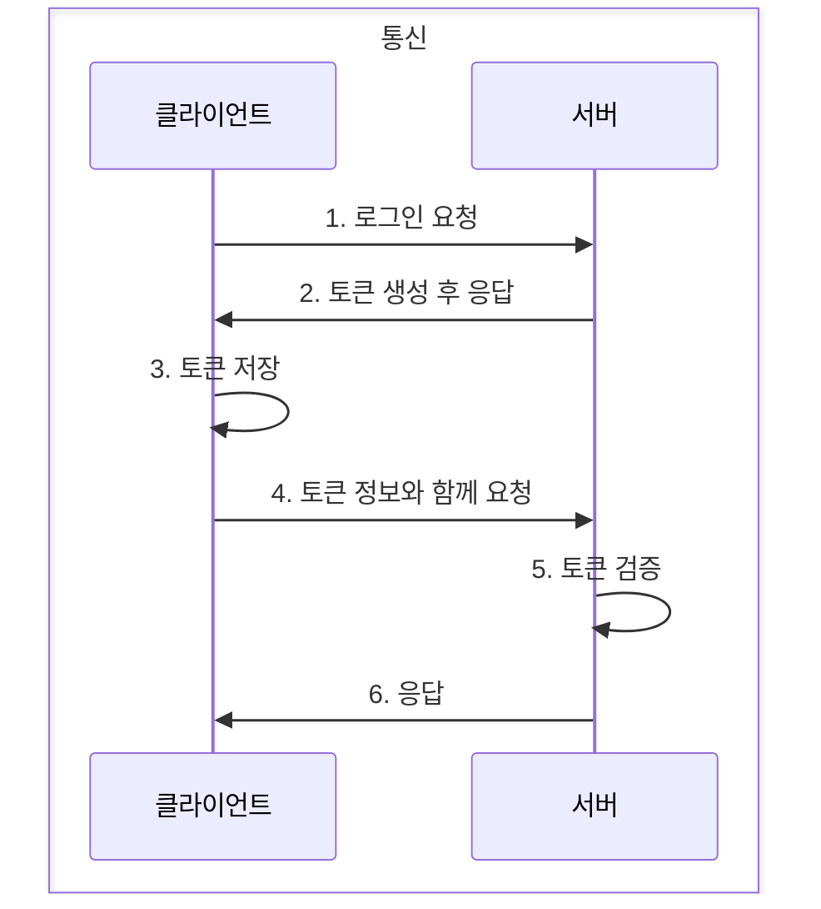
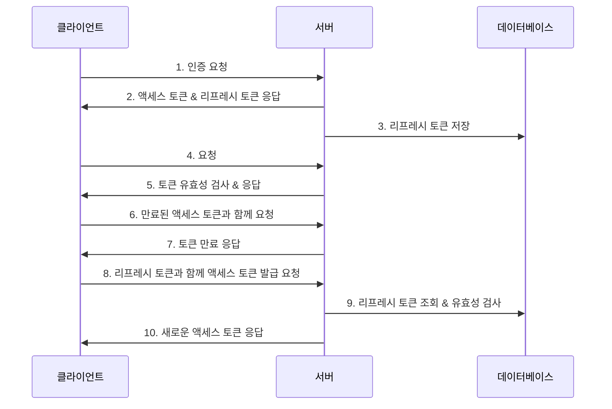
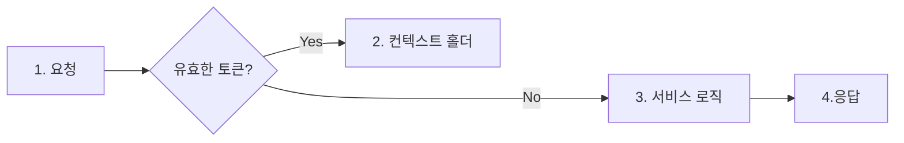

# JWT

클라이언트에게 토큰을 주고 서버는 해당 요청에 담긴 토큰을 확인하여 인증&인가를 처리한다.<br/>
발급받은 JWT를 이용해 인증을 하려면 HTTP 요청 헤더 중에 Authorization 키 값에 Bearer + JWT 토큰값을 넣어 보낸다.<br/>



### 무상태성

서버는 인증 정보를 따로 보관하지 않는다.<br/>
요청에 담긴 토큰으로만 확인하기 때문에 데이터를 유지하지 않아도 된다.<br/>

### 확장성

여러 서비스의 서버가 분리되어 있다고 해도 하나의 토큰으로 인증&인가 처리를 할 수 있다.<br/>
세션 인증 기반은 각각 API에서 인증을 해야 한다.<br/>
클라이언트가 토큰을 가지고 있기 때문에 하나의 유효한 토큰으로 여러 서비스의 권한을 공유할 수 있다.

### 무결성

토큰 방식은 HMAC(hash-based message authentication) 기법이다.<br/>
토큰의 한 글자만 달라도 유효하지 않기 때문에 무결성이 보장된다.<br/>

### 헤더

토큰의 타입과 해싱 알고리즘을 지정하는 정보를 담는다.<br/>

| 이름  | 설명                 |
|-----|--------------------|
| typ | 토큰의 타입을 지정 ex) JWT |
| alg | 해싱 알고리즘 지정         |

```json
{
  "typ": "JWT",
  "alg": "HS256"
}
```

### 페이로드

토큰과 관련된 정보.<br />
내용의 한 덩어리(키:밸류)를 클레임(claim) 이라고 부른다.<br />

#### 등록된 클레임

| 이름  | 설명                                                                                         |
|-----|--------------------------------------------------------------------------------------------|
| iss | 토큰 발급자(issuer)                                                                             |
| sub | 토큰 제목(subject)                                                                             |
| aud | 토큰 대상자(audience)                                                                           |
| exp | 토큰의 만료시간(expiration) 시간은 NumericDate 형식. 현재 시간 이후로 설정                                      |
| nbf | 토큰의 활성 날짜와 비슷한 개념으로 Not Before를 의미. NumericDate 형식으로 날짜를 지정하며, 이 날짜가 지나기 전까지는 토큰이 처리되지 않음. |
| iat | 토큰이 발급된 시간으로 iat은 issued at을 의미                                                            |
| jti | JWT의 고유 식별자로서 주로 일회용 토큰에 사용                                                                |

#### 공개 클레임 & 비공개 클레임

```json
{
  "iss": "test@email.com",     // 등록된 클레임
  "iat": 1622370878,           // 등록된 클레임
  "exp": 1622372678,           // 등록된 클레임
  "http://spring.com/jwt_claims/is_admin": true,  // 공개 클레임
  "email": "asdf@naver.com",   // 비공개 클레임
  "hello": "안녕하세요!"          // 비공개 클레임
}
```

### 시그니처

해당 토큰이 조작&변경되지 않았음을 확인하는 용도로 사용.<br />
헤더의 인코딩 값과 내용의 인코딩값을 합친 후에 주어진 비밀키를 사용해 해시값을 생성한다.

### Refresh Token

만약 토큰이 탈취당한다면 서버는 해커인지 일반 사용자인지 알 수가 없다.<br />
이미 발급한 토큰만이 인증 수단으로 사용하기 때문이다.<br />
access token은 짧은 유효기간으로 발급한다.<br />
access token을 재 발급 받는 refreshtoken을 발급한다.<br />



1. 클라이언트가 서버에게 인증 요청을 한다
2. 요청 정보를 바탕으로 유효성 검사 진행. 액세스 토큰 & 리프레쉬 토큰을 생성해 응답. 클라이언트는 해당 토큰을 저장한다.
3. 서버는 데이터베이스에 리프레쉬 토큰을 저장한다
4. 인증을 필요로하는 요청 때 클라이언트는 액세스 토큰과 함께 요청
5. 서버는 토큰 유효성 검사를 진행한 후 유효하면 요청 처리
6. 클라이언트가 서버에게 인증이 필요한 요청
7. 서버는 클라이언트에게 만료된 토큰이라고 응답
8. 클라이언트는 리프레시 토큰과 함께 새로운 액세스 토큰 발급 요청 전송
9. 서버는 클라이언트가 보낸 리프레시 토큰이 유효한지 검사한다
10. 유효하다면 클라이언트에게 새로운 액세스 토큰을 생성한 뒤 응답

### 구현

#### 의존성 추가하기

```java
implementation 'io.jsonwebtoken:jjwt:0.9.1' // 자바 JWT 라이브러리
implementation 'javax.xml.bind:jaxb-api:2.3.1' // XML 문서와 Java 객체 간 매핑을 자동화
testAnnotationProcessor 'org.projectlombok:lombok'
testImplementation 'org.projectlombok:lombok'
```

#### yml

yml 설정<br />
발급자, 비밀키를 설정한다.<br />

```yaml
jwt:
  issuer: test@naver.com
  secret_key: study-springboot
```

#### JwtProperties.java

yml에 설정한 값들에 접근하는 클래스 생성

```java
@Setter
@Getter
@Component
@ConfigurationProperties("jwt") // 자바 클래스에 프로퍼티값을 가져와서 사용하는 어노테이션
public class JwtProperties {
    private String issuer;
    private String secretKey;
}
```

#### TokenProvider.java

토큰을 생성하고 올바른 토큰인지 검사하고 토큰에 담긴 정보를 취득하는 클래스

```java
@RequiredArgsConstructor
@Service
public class TokenProvider {

    private final JwtProperties jwtProperties;

    public String generateToken(User user, Duration expiredAt) {
        Date now = new Date();

        return makeToken(new Date(now.getTime() + expiredAt.toMillis()), user);
    }
    
    // 1. JWT 생성 메서드
    private String makeToken(Date expiry, User user) {
        Date now = new Date();

        return Jwts.builder()
                .setHeaderParam(Header.TYPE, Header.JWT_TYPE) // 헤더 type : JWT
                // 내용 iss : yml 설정한 값
                .setIssuer(jwtProperties.getIssuer())
                .setIssuedAt(now) // 내용 iat : 현재 시간
                .setExpiration(expiry) // 내용 exp : expiry 멤버 변숫값
                .setSubject(user.getEmail()) // 내용 sub : 유저의 이메일
                .claim("id", user.getId()) // 클레임 id : 유저 ID
                // 서명 : 비밀값과 함께 해시값을 HS256 방식으로 암호화
                .signWith(SignatureAlgorithm.HS256, jwtProperties.getSecretKey())
                .compact();
    }
    
    // 2. JWT 유효성 검증 메서드
    public boolean validToken(String token) {
        try {
            Jwts.parser()
                    .setSigningKey(jwtProperties.getSecretKey())
                    .parseClaimsJws(token);
            return true;
        } catch (Exception e) { // 복호화 과정에서 에러가나면 유효하지 않다
            return false;
        }
    }

    // 3. 토큰 기반으로 인증 정보를 가져오는 메서드
    public Authentication getAuthentication(String token) {
        Claims claims = getClaims(token);
        Set<SimpleGrantedAuthority> authorities = Collections.singleton(new SimpleGrantedAuthority("ROLE_USER"));

        return new UsernamePasswordAuthenticationToken(
                new org.springframework.security.core.userdetails.User
                        (claims.getSubject(), "", authorities), token, authorities)
                ;
    }

    // 4. 토큰 기반으로 유저 ID를 가져오는 메서드
    public Long getUserId(String token) {
        Claims claims = getClaims(token);
        return claims.get("id", Long.class);
    }
    
    // 클레임 조회
    private Claims getClaims(String token) {
        return Jwts.parser()
                .setSigningKey(jwtProperties.getSecretKey())
                .parseClaimsJws(token)
                .getBody()
                ;
    }

}
```

1. makeToken() : 토큰 생성 메서드. 매개변수로 만료 시간, 유저 정보를 받는다. <br />
   헤더는 typ(타입)<br />
   내용은 iss(발급자), iat(발급일시), exp(만료일시), sub(토큰 제목) <br />
   클레임에는 유저 ID를 지정한다.<br />
   해싱 알고리즘은 HS256 <br />
2. validToken() : 토큰 유효성 검사 메서드. yml에 설정한 secret_key와 함께 복호화를 진행
3. getAuthentication() : 토큰을 받아 인증 정보를 담은 객체 Authentication을 반환하는 메서드.<br />
   UsernamePasswordAuthenticationToken의 첫 인자로 들어가는 User는 스프링 시큐리티에서 제공하는 객체여야 한다.<br />
4. getUserId() : 토큰에 담긴 유저 ID를 가져오는 메서드

#### 리프레시 토큰

데이터 베이스에 저장하므로 엔티티, 레파지토리를 구현해야 한다.<br />

#### RefreshToken.java

```java
@NoArgsConstructor
@Getter
@Entity
public class RefreshToken {

    @Id
    @GeneratedValue(strategy = GenerationType.IDENTITY)
    @Column(name = "id", updatable = false)
    private Long id;
    @Column(name = "user_id", nullable = false, unique = true)
    private Long userId;
    @Column(name = "refresh_token", nullable = false)
    private String refreshToken;

    public RefreshToken(Long userId, String refreshToken) {
        this.userId = userId;
        this.refreshToken = refreshToken;
    }

    public RefreshToken update(String newRefreshToken) {
        this.refreshToken = refreshToken;
        return this;
    }

}
```

#### RefreshTokenRepository.java

```java
public interface RefreshTokenRepository extends JpaRepository<RefreshToken, Long> {
    Optional<RefreshToken> findByUserId(Long userId);

    Optional<RefreshToken> findByRefreshToken(String refreshToken);
}
```

#### Token Filter

요청이 전달되기 전후에 URL 패턴에 맞는 모든 요청을 처리하는 기능을 제공<br />
요청이 오면 헤더값을 비교해서 토큰이 있는지 확인하고 유효한 토큰이라면<br />
시큐리티 콘텍스트 홀더(Security context holder)에 인증 정보를 저장한다.



시큐리티 컨텍스트 (security context)는 인증 객체가 저장되는 보관소<br />
인증 정보가 필요할 때 언제든지 이곳에서 꺼내 사용할 수 있다.<br />
이 클래스는 스레드마다 공간을 할당하는 스렏드 로컬에 저장되므로 코드의 아무 곳에서나 참조할 수 있고<br />
다른 스레드와 공유하지 않으므로 독립적으로 사용할 수 있다.<br />
시큐리티 컨텍스트 객체를 저장하는 객체가 시큐리티 컨텍스트 홀더다.<br />

#### TokenAuthenticationFilter.java

```java
@RequiredArgsConstructor
public class TokenAuthenticationFilter extends OncePerRequestFilter {
    private final TokenProvider tokenProvider;
    private final static String HEADER_AUTHORIZATION = "Authorization";
    private final static String TOKEN_PREFIX = "Bearer ";

    @Override
    protected void doFilterInternal(
            HttpServletRequest request,
            HttpServletResponse response,
            FilterChain filterChain) throws ServletException, IOException {
        
        // 요청 헤더의 Authorization 키의 값 조회
        String authorizationHeader = request.getHeader(HEADER_AUTHORIZATION);
        // 가져온 값에서 접두사("Bearer ")제거
        String token = getAccessToken(authorizationHeader);
        // 토큰 유효 검증 후 유효하다면 인증 정보 설정
        if (tokenProvider.validToken(token)) {
            Authentication authentication = tokenProvider.getAuthentication(token);
            SecurityContextHolder.getContext().setAuthentication(authentication);
        }

        filterChain.doFilter(request, response);
    }

    private String getAccessToken(String authorizationHeader) {
        if (authorizationHeader != null && authorizationHeader.startsWith(TOKEN_PREFIX)) {
            return authorizationHeader.substring(TOKEN_PREFIX.length());
        }
        return null;
    }

}
```