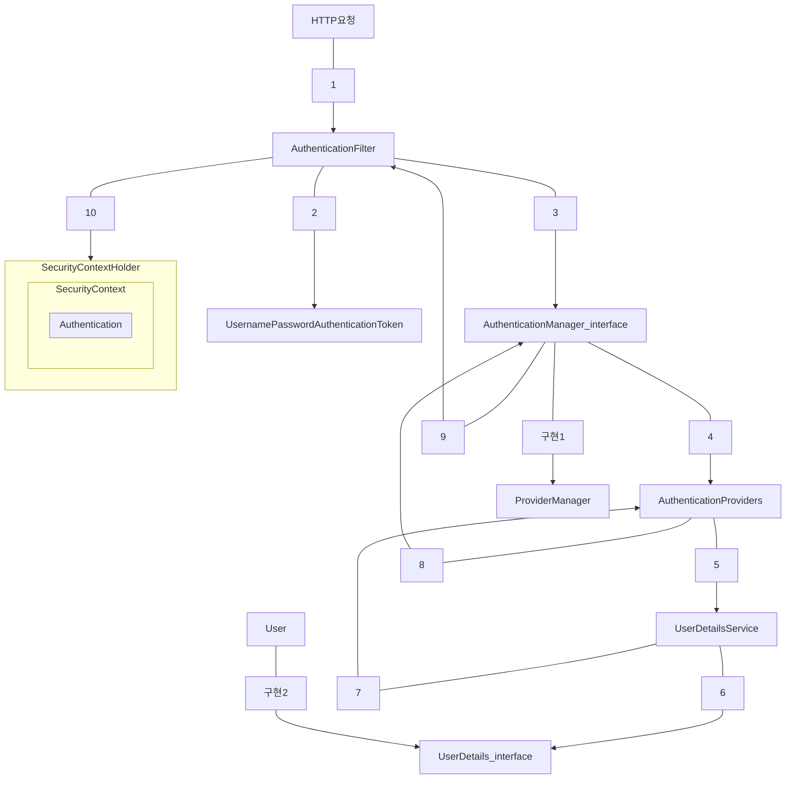

# 스프링 시큐리티로 회원가입, 로그인, 로그아웃 구현하기

## 인증

사용자의 신원을 입증하는 과정<br/>
ex) 로그인을 할 때 누구인지 확인하는 과정<br/>

## 인가

특정 부분에 접근할 수 있는 권한<br/>
ex) 일반 사용자는 관리자 페이지에 접근 불가<br/>

## 스프링 시큐리티

스프링 기반 애플리케이션의 보안을 담당하는 스프링 하위 프레임워크<br/>
CSRF 공격, 세션 고정 공격을 방어해주고, 요청 헤더도 보안 처리<br/>

- CSRF
    - 사용자의 권한을 가지고 특정 동작을 수행하도록 유도하는 공격
- 세션 고정 공격
    - 사용자의 인증 정보를 탈취하거나 변조하는 공격

- 필터 기반으로 동작하는 스프링 시큐리티

## SecurityFilterChain

| 필터명                                     | 설명                                                                                                                                             |
|-----------------------------------------|------------------------------------------------------------------------------------------------------------------------------------------------|
| SecurityContextPersistenceFilter        | SecurityContextRepository에서 SecurityContext(접근 주체와 인증에 대한 정보를 담고 있는 객체)를 가져오거나 저장하는 역할                                                         |
| LogoutFilter                            | 설정된 로그아웃 URL로 오는 요청을 확인해 해당 사용자를 로그아웃 처리                                                                                                       |
| UsernamePasswordAuthenticationFilter    | 인증 관리자. 폼 기반 로그인을 할 때 사용되는 필터로 아이디, 패스워드 데이터를 파싱해 인증 요청을 위임. 인증이 성공하면 AuthenticationSuccessHandler를, 인증에 실패하면 AuthenticationFailureHandler를 실행 |
| DefaultLoginPageGeneratingFilter        | 사용자가 로그인 페이지를 따로 지정하지 않았을 때 기본으로 설정하는 로그인 페이지 관련 필터                                                                                            |
| BasicAuthenticationFilter               | 요청 헤더에 있는 아이디와 패스워드를 파싱해서 인증 요청을 위임. 인증이 성공하면 AuthenticationSuccessHandler를, 인증에 실패하면 AuthenticationFailureHandler를 실행                         |
| RequestCacheAwareFilter                 | 로그인 성공 후, 관련 있는 캐시 요청이 있는지 확인하고 캐시 요청을 처리. ex) 로그인하지 않은 상태로 방문한 페이지를 기억해 두었다가, 로그인에 성공하면 그 페이지로 이동                                             |
| SecurityContextHolderAwareRequestFilter | HttpServletRequest 정보를 감싼다. 필터 체인 상의 다음 필터들에게 부가 정보를 제공하기 위해 사용                                                                                |
| AnonymousAuthenticationFilter           | 필터가 호출되는 시점까지 인증되지 않았다면 익명 사용자 전용 객체인 AnonymousAuthentication을 만들어 SecurityContext에 넣어줌                                                        |
| ExceptionTranslationFilter              | 인증된 사용자와 세션 관련 작업을 진행. 세션 변조 방지 전략을 설정하고, 유효하지 않은 세션에 대한 처리, 세션 생성 전략을 세우는 등의 작업을 처리                                                           |
| FilterSecurityInterceptor               | 접근 결정 관리자. AccessDecisionManager로 권한 부여 처리를 위임함으로써 접근 제어 결정을 쉽게 처리. 이 과정에서 사용자가 인증되어 있으므로 유효한 사용자인지 알 수 있음. 즉 인가 관련 설정                         |

## logic



1. 사용자가 폼에 아이디와 패스워드를 입력하여 정보 전달
    - AuthenticationFilter 가 유효성 검사
2. 실제 구현체인 UsernamePasswordAuthenticationToken 을 만들어 전달
3. 전달 받은 UsernamePasswordAuthenticationToken 을 AuthenticationManager 에게 전달
4. UsernamePasswordAuthenticationToken 을 AuthenticationProvider 에게 전달
5. 사용자 아이디를 UserDetailService 에게 전달
    - UserDetailService는 사용자 아이디로 찾은 사용자의 정보를 UserDetails 객체로 만든다
    - 이 후 AuthenticationProvider 에게 전달
6. DB에 있는 사용자 정보 취득
7. 입력 정보와 UserDetails의 정보를 비교해 실제 인증 처리
8. 인증 처리
9. 인증 처리
10. SecurityContextHolder 에 Authentication을 저장
    - 인증 성공 : AuthenticationSuccessHandler 실행
    - 인증 실패 : AuthenticationFailureHandler 실행

## 적용 예제

### dependencies

```java
// 스프링 시큐리티를 사용하기 위한 스타터
implementation'org.springframework.boot:spring-boot-starter-security'
// 타임리프에서 스프링 시큐리티를 사용하기 위한 의존성 추가
        implementation'org.thymleaf.extras:thymeleaf-extras-springsecurity6'
// 스프링 시큐리티를 테스트하기 위한 의존성 추가
        testImplementation'org.springframework.security:spring-security-test'
```

### User

UserDetails 를 implements 하도록 entity 를 구현한다.

```java
public class User implements UserDetails {
    // ... 생략 ...

    @Override
    public Collections<? extends GrantedAuthority> getAuthorities() {
        // 사용자의 권한 반환
        return List.of(new SimpleGrantedAuthority("user"));
    }

    @Override
    public String getUsername() {
        // 사용자의 id 를 리턴 (고유값)
        return email;
    }

    @Override
    public String getPassword() {
        // 사용자의 패스워드를 반환
        return Password;
    }

    @Override
    public boolean isAccountNonExpired() {
        // 계정이 만료되었는지 확인하는 메서드
        return true; // true -> 만료되지 않았음
    }

    @Override
    public boolean isAccountNonLocked() {
        // 계정이 잠금되었는지 확인하는 메서드
        return true; // true -> 잠금되지 않았음
    }

    @Override
    public boolean isCredentialsNonExpired() {
        // 비밀번호가 만료되었는지 확인하는 메서드
        return true; // true -> 만료되지 않았음
    }

    @Override
    public boolean isEnabled() {
        // 계정이 사용 가능한지 확인하는 메서드
        return true; // true -> 사용 가능
    }

}
```

| 메서드                       | 반환 타입                                  | 설명                                                     |
|---------------------------|----------------------------------------|--------------------------------------------------------|
| getAuthorities()          | Collection<? extends GrantedAuthority> | 사용자가 가지고 있는 권한의 목록을 반환.                                |
| getUsername()             | String                                 | 사용자를 식별할 수 있는 이름 반환. 고유해야함. ex) 유니크 속성이 적용된 이메일, 아이디 등 |
| getPassword()             | String                                 | 사용자의 비밀번호 반환. 이때 저장되어 있는 비밀번호는 암호화해서 저장한다.             |
| isAccountNonExpired()     | boolean                                | 계정이 만료되었는지 확인하는 메서드. 만료되지 않았다면 true                    |
| isAccountNonLocked()      | boolean                                | 계정이 잠금되었는지 확인하는 메서드. 잠금되지 않았다면 true                    |
| isCredentialsNonExpired() | boolean                                | 비밀번호가 만료되었는지 확인하는 메서드. 만료되지 않았다면 true                  |
| isEnabled()               | boolean                                | 계정이 사용 가능한지 확인하는 메서드. 사용 가능하다면 true                    |

### UserDetailService

UserDetailsService 를 implements 하도록 구현한다.

```java
public class UserDetailService implements UserDetailsService {
    private final UserRepository userRepository;

    @Override
    public UserDetails loadUserByUsername(String email) {
        return userRepository.findByEmail(email)
                .orElseThrow(() -> new IllegalArgumentException(email));
    }

}
```

### WebSecurityConfig

실제 인증 처리를 하는 시큐리티 설정 파일

```java

@RequiredArgsConstructor
@Configuration
public class WebSecurityConfig {

    private final UserDetailService userService;

    @Bean // 1. 스프링 시큐리티 기능 비활성화
    public WebSecurityCustomizer configure() {
        return (web) -> web.ignoring()
                .requestMatchers(toH2Console())
                .requestMatchers("/static/**")
                ;
    }

    @Bean // 2. 특정 HTTP 요청에 대한 웹 기반 보안 구성
    public SecurityFilterChain filterChain(HttpSecurity http) throws Exception {
        return http
                .authorizeRequests()// 3. 인증, 인가 설정
                .requestMatchers("/login", "/signup", "/user").permitAll() // 특정 요청과 일치하는 url에 대한 액세스를 설정한다.
                // permitAll 은 인증/인가 없이도 접근을 허용
                .anyRequest().authenticated() // 4. 별도의 인가는 필요하지 않지만 인증이 접근 할 수 있습니다.
                .and()
                .formLogin() // 폼 기반 로그인 설정
                .loginPage("/login") // 로그인 페이지 경로 설정
                .defaultSuccessUrl("/articles") // 로그인이 완료되었을 때 이동할 경로 설정
                .and()
                .logout() // 5. 로그아웃 설정
                .logoutSuccessUrl("/login") // 로그아웃이 완료되었을 때 이동할 경로 설정
                .invalidateHttpSession(true) // 로그아웃 이후에 세션을 전체 삭제할지 여부를 설정
                .and()
                .csrf().disable() // 6. csrf 비활성화
                .build();
    }

    @Bean // 7. 인증 관리자 관련 설정
    public AuthenticationManager authenticationManager( // 사용자 정보를 가져올 서비스를 재정의하건, 인증 방법, 예를 들어 LDAP, JDBC 기반 인증 등을 설정
                                                        HttpSecurity http,
                                                        BCryptPasswordEncoder bCryptPasswordEncoder,
                                                        UserDetailService userDetailService
    ) throws Exception {
        return http.getSharedObject(AuthenticationManagerBuilder.class)
                .userDetailsService(userService) // 8. 사용자 정보를 가져올 서비스를 설정, 이 때 반드시 UserDetailsService 를 구현해야함
                .passwordEncoder(bCryptPasswordEncoder) // 비밀번호 암호화를 위한 인코더 설정
                .and()
                .build();
    }

    @Bean // 9. 패스워드 인코더로 사용할 빈 등록
    public BCryptPasswordEncoder bCryptPasswordEncoder() {
        return new BCryptPasswordEncoder();
    }

}
```

1. 스프링 시큐리티의 모든 기능을 사용하지 않는다고 명시. 즉 인증&인가를 모든 곳에 모두 적용하지 않는다.
   일반적으로 정적 리소스에 설정.
2. 특정 HTTP 요청에 대해 웹 기반 보안을 구성
   인증&인가 및 로그인, 로그아웃 관련 설정
3. 특정 경로에 대한 액세스 설정
    - requestMatchers() : 특정 요청과 일치하는 url에 액세스 설정
    - permitAll() : 누구나 접근이 가능하게 설정. 인증&인가 없이도 접근 가능
    - anyRequest() : 위에서 설정한 url 이외에 요청에 대해서 설정
    - authenticated() : 별도의 인가는 필요하지 않지만 인증이 접근할 수 있음
4. 폼 기반 로그인 설정
    - loginPage() : 로그인 페이지 경로 설정
    - defaultSuccessUrl() : 로그인이 완료되었을 때 이동할 경로 설정
5. 로그아웃 설정
    - logoutSuccessUrl() : 로그아웃 완료 후 이동할 경로 설정
    - invalidateHttpSession() : 로그아웃 이후에 세션을 전체 삭제할지 여부 설정
6. CSRF 설정 비활성화. (실습 편의를 위해)
7. 인증 관리자 관련 설정. 사용자 정보를 가져올 서비스를 재정의하거나, 인증 방법, 예를 들어
   LDAP, JDBC 기반 인증 등을 설정
8. 사용자 서비스 설정
    - userDetailsService() : 사용자 정보를 가져올 서비스를 설정. 이때 설정하는 서비스 클래스는 반드시 UserDetailsService를 구현해야함.
    - passwordEncoder() : 비밀번호를 암호화하기 위한 인코더 설정
9. 패스워드 인코더를 빈으로 등록

## DTO

회원 가입 DTO

```java
@Getter
@Setter
public class AddUserRequest {
    private String email;
    private String password;
}
```

## 로그아웃 메서드

SecurityContextLogoutHandler의 logout() 메서드를 호출하여 로그아웃을 진행한다.

```java
public class UserApiController {

    private final UserService userService;

    @GetMapping("/logout")
    public String logout(HttpServletRequest request, HttpServletResponse response) {
        new SecurityContextLogoutHandler().logout(request, response,
                SecurityContextHolder.getContext().getAuthentication());
        return "redirect:/login";
    }

}
```